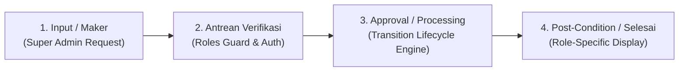

# Product Requirements Document (PRD)
## Proteksi & Penghapusan Kolom "Status Program" pada Role Admin di Halaman Program List

### 1. Executive Summary
- **Task ID**: [z8pbk8y799](https://app.clickup.com/t/90182814122/z8pbk8y799)
- **Judul Task**: Kolom "status program" di hilangkan pada role admin
- **Target**: Memastikan user dengan role `admin` tidak dapat melihat kolom "Status Program" maupun mengubah lifecycle status program (`unlaunch` -> `launch` -> `learning` -> `done`). Fitur perubahan status program secara eksklusif dikhususkan hanya untuk role `super_admin`.

---

### 2. Identifikasi Masalah & Komparasi Kode

| Komponen / File | Kondisi Saat Ini (Existing) | Kondisi Target (Fix) | Dampak & Risiko |
| :--- | :--- | :--- | :--- |
| **Header Table** [`table.hbs:52-54`](file:///E:/Wiratek%20Projek/clone%20e-learning/src/views/partials/components/ui/admin/program/table.hbs#L52-L54) | Kolom `
Status Program
` dirender secara publik untuk semua role (`admin` & `super_admin`). | Dibungkus kondisi Handlebars `{{#if isSuperAdmin}}...{{/if}}`. | Admin melihat header kolom status program. |
| **Row Cell Table** [`table.hbs:122-221`](file:///E:/Wiratek%20Projek/clone%20e-learning/src/views/partials/components/ui/admin/program/table.hbs#L122-L221) | Dropdown lifecycle status program dirender untuk setiap baris program tanpa pengecekan role. | Dibungkus kondisi Handlebars `{{#if isSuperAdmin}}...{{/if}}`. | Admin dapat membuka dropdown dan memicu perubahan status ke database. |
| **Table Layout & Width** [`table.hbs:27,34,62,82`](file:///E:/Wiratek%20Projek/clone%20e-learning/src/views/partials/components/ui/admin/program/table.hbs#L27) | `min-w-[1168px]` statis dan kolom nama program dipatok `max-w-[210px]`. | Jika `!isSuperAdmin`, `min-w-[1043px]` dan `max-w-[210px]` dinonaktifkan agar `flex-1` menyerap ruang kosong 10.5% secara responsif. | Tampilan tabel bolong/kosong di sisi kanan jika kolom dihapus tanpa penyesuaian lebar. |
| **API Endpoint Security** [`courses.controller.ts:1475`](file:///E:/Wiratek%20Projek/clone%20e-learning/src/courses/courses.controller.ts#L1475) | Endpoint `PATCH /program/:courseId/status-json` diizinkan untuk `@Roles('admin', 'super_admin')`. | Diperketat menjadi `@Roles('super_admin')`. | Admin dapat melakukan bypass UI melalui pemanggilan API langsung (Broken Object Level Authorization). |
| **Legacy Launch Endpoints** [`courses.controller.ts:1432,1454,1500`](file:///E:/Wiratek%20Projek/clone%20e-learning/src/courses/courses.controller.ts#L1432) | Endpoint `toggle-launch`, `toggle-launch-json`, dan `toggle-status` berdekorator `@Roles('admin', 'super_admin')`. | Diperketat menjadi `@Roles('super_admin')`. | Admin dapat mengubah flag launch program melalui curl/script. |

---

### 3. Nomor Urut Alur Bisnis Pengelolaan Status Program

1. **Input / Maker**:
   - Super Admin memilih opsi status pada dropdown baris program di halaman `/program` (`Launch`, `Learning`, `Rollback to Unlaunch`, atau `Mark as Done`).
   - Modal konfirmasi menampilkan ringkasan konsekuensi perubahan status.
   - Admin biasa **tidak memiliki akses UI input** karena kolom dan trigger dihilangkan.
2. **Antrean Verifikasi (Authentication & Authorization Guard)**:
   - Request dikirimkan via `PATCH /program/:courseId/status-json`.
   - `RolesGuard` NestJS memeriksa `req.user.role`.
   - Jika role adalah `super_admin`: lolos verifikasi.
   - Jika role adalah `admin` atau `user`: dicegat langsung dengan respon `403 Forbidden`.
3. **Approval / Processing (State Machine Validation)**:
   - `CoursesService.updateProgramStatus` memvalidasi aturan transisi:
     - `unlaunch` -> `launch`
     - `launch` -> `unlaunch` (rollback sebelum belajar dimulai)
     - `launch` -> `learning` (kegiatan kelas aktif)
     - `learning` -> `done` (terminal state terkunci)
   - Sinkronisasi flag `course.launch = (targetStatus === 'launch')`.
   - Data tersimpan secara persisten ke tabel `courses`.
4. **Post-Condition / Penyajian Data**:
   - Respon JSON `{ success: true, status, launch }` dikembalikan ke client.
   - Pada browser Super Admin: badge status diperbarui sesuai lifecycle.
   - Pada browser Admin: tabel program dirender tanpa kolom "Status Program" (hanya menampilkan kolom No, Cover, Program Name, Group, Category, Status Approved/Pending, Quota, Student, dan Action).

---

### 4. Batasan & Acceptance Criteria

1. **Role Admin**:
   - Header tabel pada halaman `/program` tidak menampilkan kolom "Status Program".
   - Setiap baris tabel tidak memiliki dropdown trigger ubah status.
   - Tidak ada layout shift / whitespace abnormal pada tabel.
   - Request manual ke `PATCH /program/:id/status-json` menghasilkan HTTP `403 Forbidden`.
2. **Role Super Admin**:
   - Kolom "Status Program" tetap muncul lengkap beserta dropdown perubahan lifecycle status.
   - Transisi status berjalan normal seperti semula.
   - Endpoint backend tetap dapat diakses sukses.
