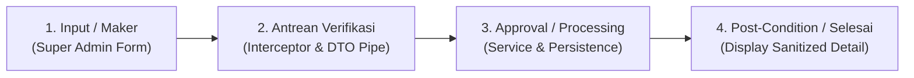

# Product Requirements Document (PRD)
## Perbaikan Detail Program & Penanganan Bad Request Create Program (Role Super Admin)

### 1. Executive Summary
Dokumen ini mendefinisikan perbaikan atas bug visual pada halaman Detail Program (role Admin dan Super Admin) berdasarkan task ClickUp [z8pbk8xww1](https://app.clickup.com/t/90182814122/z8pbk8xww1) dan catatan review dari Indra Ajiyanto, serta investigasi akar masalah error **Bad Request** saat Super Admin membuat program baru.

---

### 2. Identifikasi Branch & Komit Penyebab Error

| Masalah | File & Lokasi Kode | Penyebab Kode Riil | Branch & Komit Penyebab |
|---|---|---|---|
| **1. Label Form Link masih muncul di Paid Program** | [super_admin/course/detail.hbs:74-78](file:///E:/Wiratek%20Projek/clone%20e-learning/src/views/super_admin/course/detail.hbs#L74-L78) [components/ui/admin/detail/form_info/index.hbs:27-32](file:///E:/Wiratek%20Projek/clone%20e-learning/src/views/partials/components/ui/admin/detail/form_info/index.hbs#L27-L32) | Blok `{{#if (isPaidProgram course)}}` tetap merender `{{#if course.form}}...Form link...{{/if}}`. Padahal program berbayar tidak menggunakan form eksternal. | **Branch:** `sayyid-test` **Komit:** `d08218e4` (*Sayyid Murtaja*) |
| **2. Label Target masih muncul di Paid & Free** | [super_admin/course/detail.hbs:140-144](file:///E:/Wiratek%20Projek/clone%20e-learning/src/views/super_admin/course/detail.hbs#L140-L144) [components/ui/admin/detail/learning/index.hbs:21-24](file:///E:/Wiratek%20Projek/clone%20e-learning/src/views/partials/components/ui/admin/detail/learning/index.hbs#L21-L24) | Blok `Target` dibiarkan aktif di dalam card *Learning Details*, padahal instruksi task meminta target tidak ditampilkan baik di paid maupun free program. | **Branch:** `sayyid-test` **Komit:** `d08218e4` (*Sayyid Murtaja*) |
| **3. Bad Request saat Create Program (createKelas)** | [courses.controller.ts:201-202](file:///E:/Wiratek%20Projek/clone%20e-learning/src/courses/courses.controller.ts#L201-L202) [formCreate.hbs:107-116](file:///E:/Wiratek%20Projek/clone%20e-learning/src/views/admin/course/formCreate.hbs#L107-L116) | `buildCreateDto(body, req.user)` memvalidasi DTO via `ValidationPipe` **sebelum** `dto.categoryId = categoryId`. Karena input kategori di form dibuat disabled, `body.categoryId` kosong (`""`), memicu kegagalan `@IsUUID()` -> 400 Bad Request. | **Branch:** `sayyid-test` **Komit:** `59d67a60` & `d08218e4` |
| **4. Bad Request saat Create Program (Tag & Group)** | [courses.controller.ts:58-67](file:///E:/Wiratek%20Projek/clone%20e-learning/src/courses/courses.controller.ts#L58-L67) [create-courses.dto.ts:33-37, 46](file:///E:/Wiratek%20Projek/clone%20e-learning/src/courses/dto/create-courses.dto.ts#L33-L46) [card_01_basic_info.hbs:169-184](file:///E:/Wiratek%20Projek/clone%20e-learning/src/views/partials/admin/program/create/card_01_basic_info.hbs#L169-L184) | 1. Label UI bertuliskan `Tag` (tanpa tanda bintang `*`), namun DTO mewajibkan `@IsUUID() courseTypeId`. Jika user mengosongkan Tag, validasi gagal. 2. Format error handler controller (`L101` & `L217`) hanya menangkap `error.message` bawaan (`"Bad Request Exception"` / `"Bad Request"`), sehingga detail pesan validasi tersembunyi dari user. | **Branch:** `sayyid-test` **Komit:** `d08218e4` (*Sayyid Murtaja*) |

---

### 3. Alur Bisnis Pengelolaan Program (4 Tahapan Runtut)

1. **Input / Maker**:
   - Super Admin mengisi data program via form pembuatan (`/program/create` atau `/program/formCreate/:categoryId`).
   - Parameter kategori otomatis terikat jika dibuat dari kategori.
   - Tag (`courseTypeId`) diselaraskan: jika bersifat opsional di UI, DTO harus memperlakukannya sebagai `@IsOptional()`.
2. **Antrean Verifikasi (Data Processing & Validation)**:
   - `ValidateImageInterceptor` memvalidasi dimensi cover program (1900x1000 - 1920x1080) dan menyimpannya ke `/asset/program/`.
   - `CoursesController.buildCreateDto` memetakan payload wire ke DTO dan menjalankan `ValidationPipe`.
   - Pada endpoint `POST /program/:categoryId`, injeksi `categoryId` dilakukan sebelum transformasi validasi pipe agar tidak memicu 400 Bad Request.
   - Jika terjadi error validasi, tangkap `error.getResponse()` agar pesan spesifik tampil ke flash toast pengguna, bukan kata generik `"Bad Request"`.
3. **Approval / Service Execution**:
   - `CoursesService.create` menyimpan program ke database PostgreSQL dan mengaitkan relasi teknologi dan kategori.
   - Super Admin auto-approved (`dto.process = 'approved'`), dan mentor dikaitkan bila `mentoringsId` disediakan.
4. **Post-Condition / Penyajian Detail Program**:
   - **Paid Program**: Tampilkan `Price`, `Promo`, dan `Type: Paid`. **Hapus** `Form link` dan **Hapus** `Target`.
   - **Free Program**: Tampilkan `Form link` dan `Type: Free`. **Hapus** `Target`.
   - Basic Information: Sembunyikan `Time Start` dan `Time End` jika Paid Program.

---

### 4. Spesifikasi Perubahan (Gap Analysis)

#### A. Halaman Detail Super Admin (`src/views/super_admin/course/detail.hbs`)
- **Baris 74-78**: Hapus blok `Form link` di bawah `{{#if (isPaidProgram course)}}`.
- **Baris 140-144**: Hapus blok label dan value `Target` dari card `Learning Details`.

#### B. Komponen Form Info Admin (`src/views/partials/components/ui/admin/detail/form_info/index.hbs`)
- **Baris 27-32**: Hapus blok `Form link` di bawah `{{#if (isPaidProgram course)}}`.

#### C. Komponen Learning Details Admin (`src/views/partials/components/ui/admin/detail/learning/index.hbs`)
- **Baris 21-24**: Hapus blok label dan value `Target`.

#### D. Controller & DTO Backend (`src/courses/`)
- **`src/courses/courses.controller.ts`**:
  - Pada method `createKelas` (L201), set `body.categoryId = categoryId` **sebelum** memanggil `buildCreateDto(body, req.user)`.
  - Pada blok catch `create` (L100-103) dan `createKelas` (L216-219), perbaiki ekstraksi pesan error dari `error.getResponse?.()?.message` agar rincian validasi tampil jelas.
- **`src/courses/dto/create-courses.dto.ts`**:
  - Tambahkan `@IsOptional()` pada `courseTypeId` (L45-46) bila Tag diperbolehkan kosong (sesuai label UI "Tag" tanpa `*`), atau tandai required di view jika wajib.
