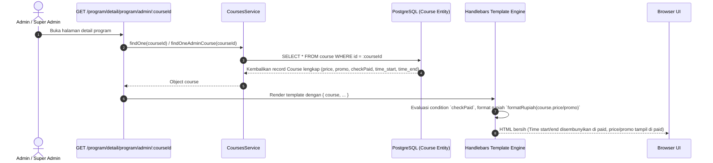

# Product Requirements Document (PRD) - Merapikan Halaman Detail Program (Role Admin & Super Admin)

## 1. Executive Summary & Objective
Penyesuaian tampilan informasi pada halaman Detail Program untuk role **Admin** dan **Super Admin** di menu `Learning -> Program` berdasarkan task ClickUp [z8pbk8xww1](https://app.clickup.com/t/90182814122/z8pbk8xww1).

Tujuan utama:
1. **Membersihkan data yang tidak relevan**:
   - Pada **Paid Program**: Sembunyikan jam pelaksanaan (`Time start` dan `Time end`) dari card **Basic Information** karena program berbayar berbasis jadwal per-sesi/per-minggu dinamis, dan pastikan `target` tidak ditampilkan di card **Form & Information**.
   - Pada **Free Program**: Pastikan `target` tidak ditampilkan di card **Form & Information**.
2. **Melengkapi data finansial pada Paid Program**:
   - Menambahkan field **Price** (harga normal) dan **Promo** (harga promo) pada card **Form & Information** menggunakan data riil dari entitas `Course` backend (`course.price` dan `course.promo`) dengan pemformatan mata uang Rupiah (`formatRupiah`).

---

## 2. Analisis & Gap Analisis Kode Saat Ini

| Halaman / Komponen | File Terkait | Kondisi Saat Ini di Repositori | Kebutuhan Task ClickUp [z8pbk8xww1] | Rencana Solusi |
|---|---|---|---|---|
| **Super Admin - Basic Information** | [super_admin/course/detail.hbs:51-54](file:///E:/Wiratek%20Projek/clone%20e-learning/src/views/super_admin/course/detail.hbs#L51-L54) | `Time Start` dan `Time End` selalu ditampilkan tanpa memandang tipe program | Sembunyikan `Time Start` & `Time End` jika program berbayar (`checkPaid = true`) | Bungkus dengan `{{#unless course.checkPaid}}` |
| **Super Admin - Form & Information** | [super_admin/course/detail.hbs:64-80](file:///E:/Wiratek%20Projek/clone%20e-learning/src/views/super_admin/course/detail.hbs#L64-L80) | Hanya menampilkan `Form link` dan `Type` | Pada Paid Program: Tambahkan `Price` dan `Promo`. Pastikan `target` tidak muncul | Tambahkan field `Price` dan `Promo` di bawah `{{#if course.checkPaid}}` |
| **Admin - Basic Information** | [components/ui/admin/detail/basic_info/index.hbs:39-40](file:///E:/Wiratek%20Projek/clone%20e-learning/src/views/partials/components/ui/admin/detail/basic_info/index.hbs#L39-L40) | `Time Start` dan `Time End` selalu ditampilkan | Sembunyikan `Time Start` & `Time End` jika program berbayar (`checkPaid = true`) | Bungkus dengan `{{#unless course.checkPaid}}` |
| **Admin - Form & Information** | [components/ui/admin/detail/form_info/index.hbs:17-32](file:///E:/Wiratek%20Projek/clone%20e-learning/src/views/partials/components/ui/admin/detail/form_info/index.hbs#L17-L32) | Hanya menampilkan `Form link` dan `Type:` | Pada Paid Program: Tambahkan `Price` dan `Promo`. Pastikan `target` tidak muncul | Tambahkan field `Price` dan `Promo` di bawah `{{#if course.checkPaid}}` |

---

## 3. Alur Data End-to-End (Backend ke Frontend)

1. **Database Layer**:
   - Entitas [`Course`](file:///E:/Wiratek%20Projek/clone%20e-learning/src/entities/course.entity.ts) menyimpan kolom `price` (number), `promo` (number), `checkPaid` (boolean), `time_start` (string/date), dan `time_end` (string/date).
2. **Service Layer**:
   - Super Admin: [`courses.service.ts:1514`](file:///E:/Wiratek%20Projek/clone%20e-learning/src/courses/courses.service.ts#L1514) `findOne(courseId)`.
   - Admin: [`courses.service.ts:1424`](file:///E:/Wiratek%20Projek/clone%20e-learning/src/courses/courses.service.ts#L1424) `findOneAdminCourse(courseId)`.
   - Kedua method mengambil entity tanpa filtering kolom, sehingga seluruh data `price`, `promo`, dan `checkPaid` sudah langsung tersedia tanpa memerlukan modifikasi query backend.
3. **Controller Layer**:
   - [`courses.controller.ts:709`](file:///E:/Wiratek%20Projek/clone%20e-learning/src/courses/courses.controller.ts#L709) (`detailKelas`) meneruskan object `course` ke view.
4. **View Layer (Handlebars SSR)**:
   - Helper [`formatRupiah`](file:///E:/Wiratek%20Projek/clone%20e-learning/src/common/helpers/number.helpers.ts#L12) memformat angka integer ke format standar `Rp X.XXX.XXX`.

---

## 4. Alur Bisnis Penyajian Data Program (4 Tahapan Runtut)

1. **Input / Maker (Penyusunan Program)**: Admin / Super Admin membuat atau memperbarui program melalui form create/edit program, menentukan apakah program berbayar (`checkPaid = true`) dengan menetapkan harga (`price`) dan promo (`promo`), atau gratis (`checkPaid = false`) dengan menentukan jam sesi (`time_start` & `time_end`).
2. **Antrean Verifikasi (Data Processing & Loading)**: Controller menerima permintaan detail program, memuat entitas `Course`, dan memeriksa status `checkPaid`.
3. **Approval / Visual Filtering**:
   - Jika `course.checkPaid === true`:
     - Card **Basic Information** meniadakan baris `Time start` dan `Time end`.
     - Card **Form & Information** menampilkan baris `Price` dan `Promo` yang diformat dengan Rupiah.
   - Jika `course.checkPaid === false`:
     - Card **Basic Information** menampilkan baris `Time start` dan `Time end`.
     - Card **Form & Information** hanya menampilkan `Form link` dan `Type: Free`.
4. **Post-Condition / Selesai**: Informasi program tersaji secara presisi dan relevan bagi pengelola program (Admin & Super Admin) tanpa redundansi atau data kosong.
